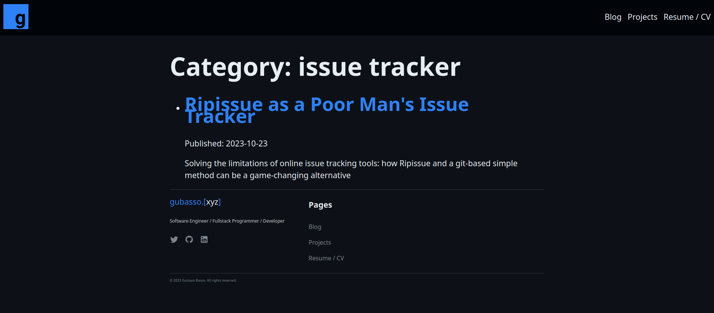

# chat

> The line-height issue remains on 1920x1080 screen
>
> .

Done!

> I wrote my considerations about the article on the file `article-review-2.md` on `/ripi/Issue/write_one_real_blog_post` path. There is just one appointment on line 56 (link missing). After your analysis, it's approved!

Done!

--

`Gustavo Basso <gubasso@eambar.net>`

---

The line-height issue remains on 1920x1080 screen

.

I wrote my considerations about the article on the file `article-review-2.md` on `/ripi/Issue/write_one_real_blog_post` path. There is just one appointment on line 56 (link missing). After your analysis, it's approved!

--

`Ismael Pamplona <ismaelpamplona@hotmail.com>`

---

> I will write my considerations about the article on the file `article-review.md` on `/ripi/Issue/write_one_real_blog_post` path.
> Inside square brackets `[<original-text>]` is the original text and inside a curly brackets `{<suggested-text>} "<suggestion-comments>"` is my suggestions
> When I suggest deleting a text, I will do it like this: from `[<your-text>]` to empty curly brackets {}

Thank you for your suggestions. They were very well thought out. I have implemented almost everything you wrote. However, I have a question for you regarding the last suggestion (please search for the `> Question:` string).

See what you think about everything that was made.

> On article description, you wrote *Ripissue*. This term is not being formatted (neither italic nor bold). I don't know if this was your intention.
>
> /blog/ripissue-as-a-poor-mans-issue-tracker

I removed the "*". Maybe later I'll try to make this `description` text render as a `markdown` syntax.

> I accidentally found a css bug on the categories page: `/blog/categories/rust`. One line is trespassing the space of the other line. Maybe, you need to increase the `line-height` property.

I have adjusted the css.

> Gustavo, your personal website is amazing!

Thanks bro!

--

`Gustavo Basso <gubasso@eambar.net>`

---

I will write my considerations about the article on the file `article-review.md` on `/ripi/Issue/write_one_real_blog_post` path.
Inside square brackets `[<original-text>]` is the original text and inside a curly brackets `{<suggested-text>} "<suggestion-comments>"` is my suggestions
When I suggest deleting a text, I will do it like this: from `[<your-text>]` to empty curly brackets {}

On article description, you wrote *Ripissue*. This term is not being formatted (neither italic nor bold). I don't know if this was your intention.
/blog/ripissue-as-a-poor-mans-issue-tracker

I accidentally found a css bug on the categories page: `/blog/categories/rust`. One line is trespassing the space of the other line. Maybe, you need to increase the `line-height` property.

Gustavo, your personal website is amazing!

--

`Ismael Pamplona <ismaelpamplona@hotmail.com>`
